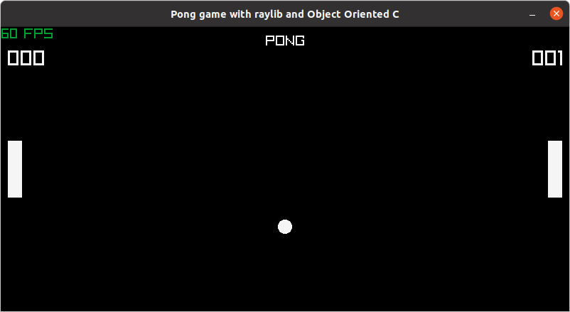

# ooc-pong-raylib
 A simple pong game using raylib and ooc.
# OOC
 Homebuilt object-oriented solution based on the book [Object-oriented Programming with ANSI-C](https://www.cs.rit.edu/~ats/books/ooc.pdf) by 
 Axel-Tobias Schreiner. The book walks you through step-by-step to build your own Object Oriented Class system with inheritance. The 
 implementation here stopped at chapter 6 of the book. It is therefore very rudimentary but also very simple to implement. The folder ooc/ 
 holds all the files needed for the simplified ooc implementation.
# Raylib
 [Raylib](https://www.raylib.com/) is fantastic game engine written in pure C, which is rare nowadays.
 